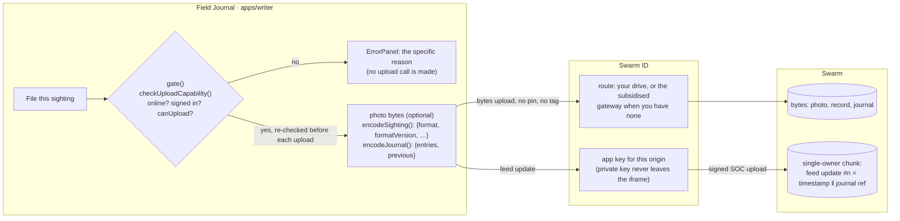
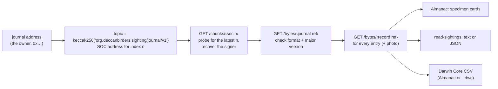
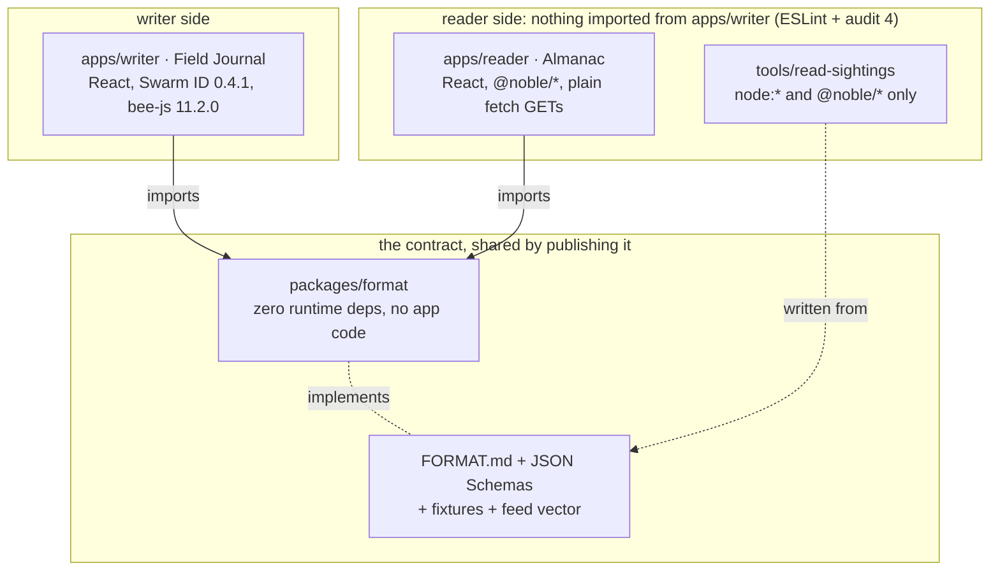
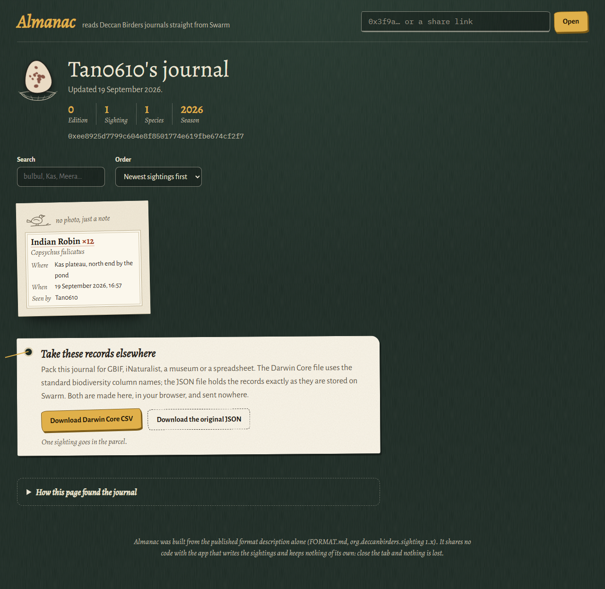
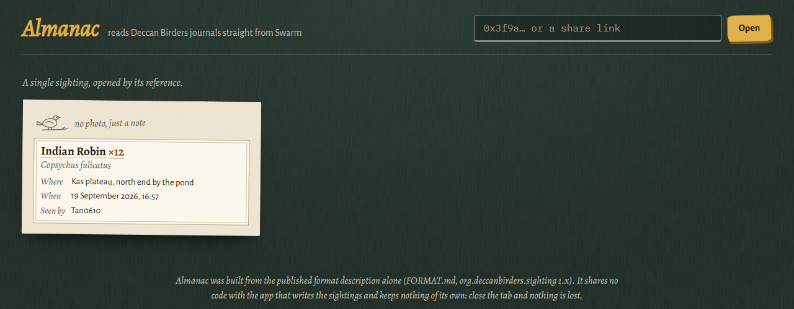
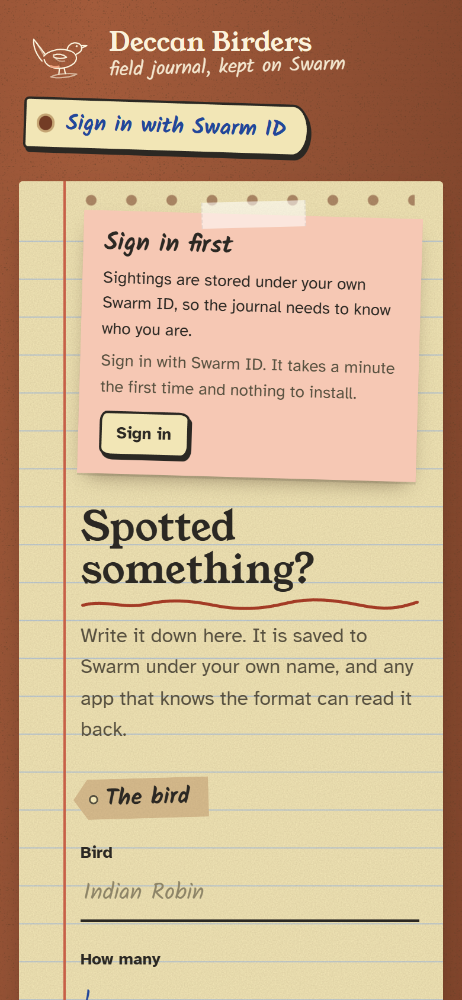
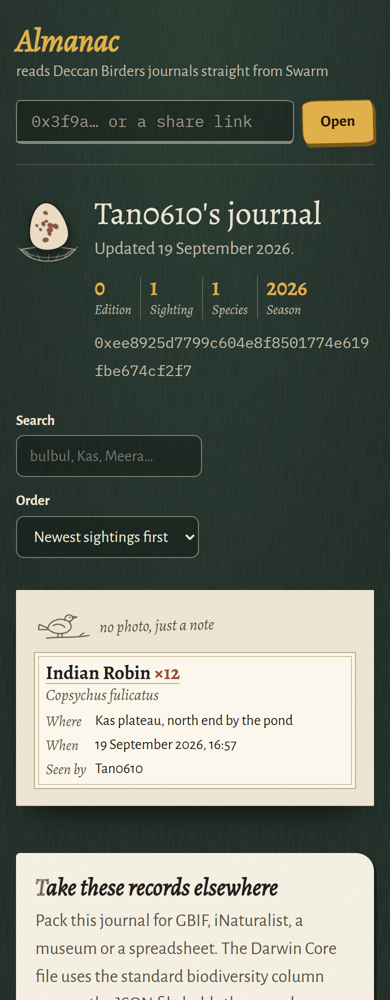
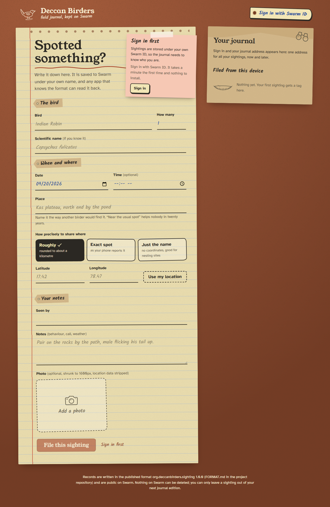
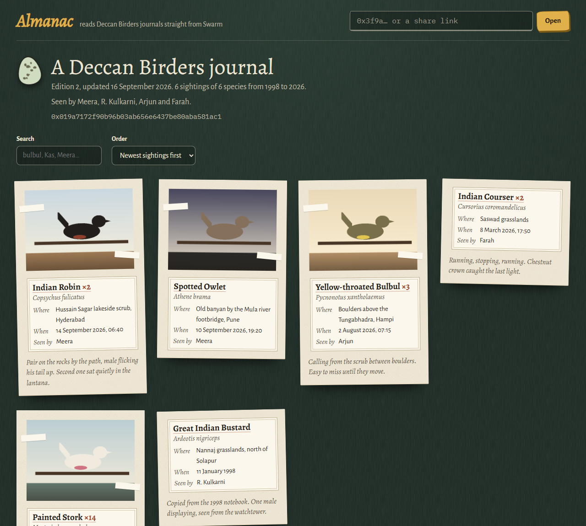
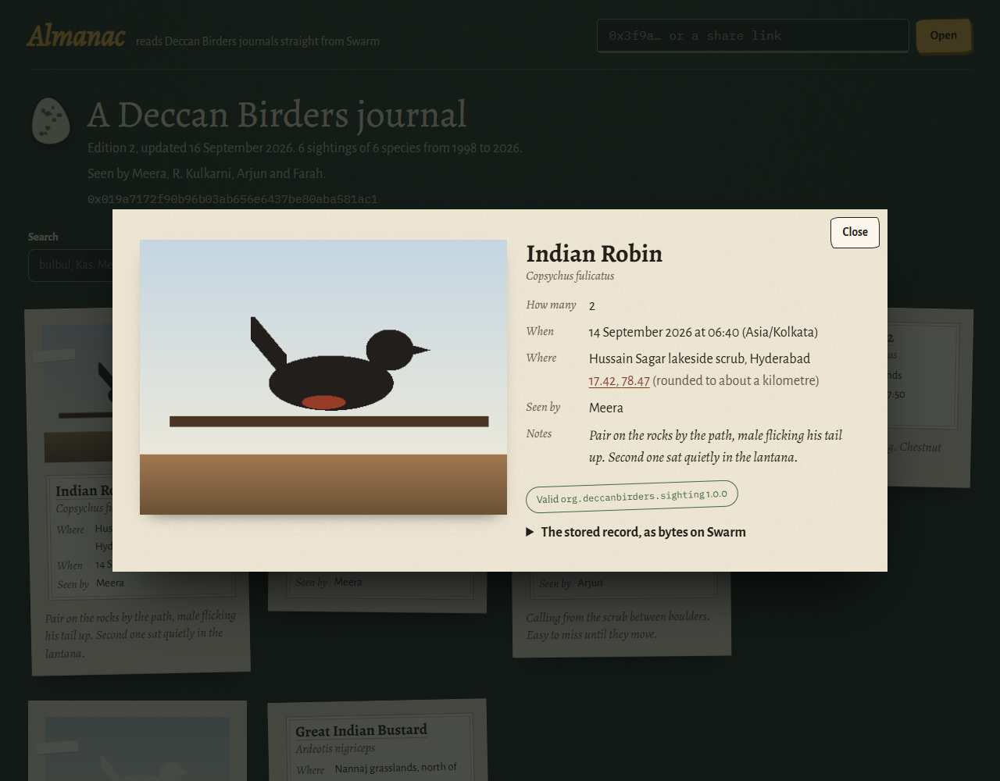

<p align="center">
  
</p>

<p align="center">
  <a href="https://deccan-field-journal.vercel.app"></a>
  <a href="https://deccan-almanac.vercel.app/?owner=0xee8925d7799c604e8f8501774e619fbe674cf2f7"></a>
  <a href="https://github.com/24f1001822iitm/birders/actions/workflows/check.yml"></a>
  <a href="scripts/audit-checks.mjs"></a>
  <a href="#run-it-locally"></a>
  <br>
  
  
  
  
  <a href="LICENSE"></a>
</p>

The Deccan Birders have kept sighting records since 1998 and lost them to three apps: a forum that
closed, a Facebook group that ate the photos, and a birding app that was bought, shut down, and left
a CSV where the location column said "near the usual spot". Meera's one rule for the next move:
**whatever writes the records must not be the only thing that can read them.**

So a sighting filed in the **Field Journal** is stored on Swarm under the birder's own Swarm ID, as
self-describing JSON, and is read back by **Almanac**, a separate app on another origin that shares
no code with the writer, or by a one-file CLI, or by whatever someone writes next year from
[`FORMAT.md`](FORMAT.md). Nobody exports anything, because the records were never inside the app.

**Contents:** [60-second tour](#60-second-tour) · [What the judge checks](#what-the-judge-checks) ·
[How it fits together](#how-it-fits-together) · [Screenshots](#screenshots) · [Try it live](#try-it-live) ·
[Verify without us](#verify-without-us) · [Build a fourth app](#build-a-fourth-app) ·
[Run it locally](#run-it-locally) · [Details](#details)

## 60-second tour

| | Where |
|---|---|
| ✍️ **Field Journal** (writer) | https://deccan-field-journal.vercel.app · [`apps/writer`](apps/writer) |
| 📖 **Almanac** (independent reader, its own origin) | https://deccan-almanac.vercel.app · [`apps/reader`](apps/reader) |
| ⌨️ **`read-sightings`** (CLI reader, imports nothing from this repo) | [`tools/read-sightings/read-sightings.mjs`](tools/read-sightings/read-sightings.mjs) |
| 📜 **The format** a fourth app relies on | [`FORMAT.md`](FORMAT.md), [JSON Schemas](packages/format/schema), [fixtures and a signed feed-update vector](packages/format/fixtures) |

> [!NOTE]
> **Live proof.** A real sighting (Indian Robin ×12, Kas plateau) was filed through the live writer
> on 19 September 2026 with Swarm ID and the subsidised public gateway, then read back by three
> readers that share no code with it.
> Journal address `0xee8925d7799c604e8f8501774e619fbe674cf2f7` ·
> [open it in Almanac](https://deccan-almanac.vercel.app/?owner=0xee8925d7799c604e8f8501774e619fbe674cf2f7) ·
> `npm run read -- --owner 0xee8925d7799c604e8f8501774e619fbe674cf2f7` ·
> every reference, the signature check and the Darwin Core export: [`docs/LIVE_EVIDENCE.md`](docs/LIVE_EVIDENCE.md)

**Three readers, none of which imports the writer:**

| Reader | What it may import | Held there by |
|---|---|---|
| **Almanac** | only [`@deccan-birders/format`](packages/format) (zero runtime deps, no app code), React, `@noble/*` | ESLint `no-restricted-imports`; audit check 4 scans its sources, `package.json` and the built bundle |
| **`read-sightings` CLI** | **nothing** from this repo: one file, `node:*` and `@noble/*` only, with its own copy of the Darwin Core mapping | audit check 4; [`tests/end-to-end.test.ts`](tests/end-to-end.test.ts), [`tests/dwc-parity.test.ts`](tests/dwc-parity.test.ts) |
| **Any fourth app** | [`FORMAT.md`](FORMAT.md) and the data on Swarm | the [§6 reader checklist](FORMAT.md#6-writing-a-reader-checklist) and fixtures; [§7](FORMAT.md#7-mapping-to-darwin-core) maps every record to [Darwin Core](https://dwc.tdwg.org/terms/) for GBIF, iNaturalist imports or a spreadsheet |

## What the judge checks

The eight scored test cases (80 points), word for word, with the code that meets each one. Every
row is re-verified from source by `npm run audit:checks` (and the built reader bundle for #4), which
runs in [CI](.github/workflows/check.yml) on every push. The full reasoning per row is in
[How each check is met](#how-each-check-is-met).

| # | Test case | Pts | Where it is met | Evidence |
|---|---|---|---|---|
| 1 | Upload capability is checked before an upload is attempted | 12 | [`uploader.ts` → `createUploader`, `gate`](apps/writer/src/swarm/uploader.ts#L20): each upload method starts with `await gate()`, which runs [`capability.ts` → `checkUploadCapability`](apps/writer/src/swarm/capability.ts#L16) | [`gate.test.ts`](apps/writer/test/gate.test.ts): signed out, no drive, failed stamper and offline make **no** upload call; ESLint bans upload calls outside the two uploader branch files; audit 1 |
| 2 | An upload route is configured for a user who holds no stamp | 6 | [`client.ts` → `getSwarmId`](apps/writer/src/swarm/client.ts#L15) passes `subsidisedGatewayUrl` from [`config.ts`](apps/writer/src/config.ts#L30) (`https://api.gateway.ethswarm.org/`) | the live filing used exactly this route: no drive, no node, no stamp bought ([evidence](docs/LIVE_EVIDENCE.md#the-filing)); audit 2 |
| 3 | Each stored record carries its own format identifier and version | 14 | [`codec.ts` → `encodeSighting`](packages/format/src/codec.ts#L30), [`encodeJournal`](packages/format/src/codec.ts#L48): `format` and `formatVersion` are the first keys inside the uploaded bytes | the live record begins `{"format":"org.deccanbirders.sighting","formatVersion":"1.0.0",…` ([evidence](docs/LIVE_EVIDENCE.md#the-addresses)); [`format.test.ts`](packages/format/test/format.test.ts); audit 3 |
| 4 | A reader exists that does not import the writing app's code | 14 | [`apps/reader/package.json`](apps/reader/package.json) (only `@deccan-birders/format` from the workspace); [`journal.ts` → `loadJournalByOwner`](apps/reader/src/journal.ts#L42); plus the [CLI](tools/read-sightings/read-sightings.mjs), which imports nothing from the repo | ESLint `no-restricted-imports`; audit 4 also checks the built bundle has no `SwarmIdClient`/axios; Almanac on its own origin read the live journal |
| 5 | Records are read back through the same endpoint family they were written to | 10 | bytes uploads are read with `GET /bytes` in [`bytes.ts` → `downloadBytes`](apps/reader/src/swarm/bytes.ts#L8); the single-owner-chunk feed update is read with `GET /chunks` in [`feed.ts` → `fetchFeedUpdate`](apps/reader/src/swarm/feed.ts#L85) ([FORMAT.md §4](FORMAT.md#4-where-each-object-lives)) | `curl` lines for the live chunk, journal and record in [LIVE_EVIDENCE](docs/LIVE_EVIDENCE.md#the-addresses); nothing reads `/bzz`; audit 5 |
| 6 | Pin and tag options are not passed on the gateway upload path | 6 | [`uploader.swarmId.ts`](apps/writer/src/swarm/uploader.swarmId.ts#L14): `GatewaySafeUploadOptions = … & { pin?: never; tag?: never }` for [`uploadBytesViaSwarmId`](apps/writer/src/swarm/uploader.swarmId.ts#L16); the feed update passes only `{ index, hasTimestamp, encrypt }` | the type makes it a compile error; ESLint bans `pin: true`/`tag` outside [`uploader.ownNode.ts`](apps/writer/src/swarm/uploader.ownNode.ts) (your own node only); audit 6 |
| 7 | A failed or unavailable upload produces a specific reason | 10 | [`errors.ts` → `MESSAGES`](apps/writer/src/errors.ts#L42) (20 failure codes, each with its own title, message and next step) and [`classifyError`](apps/writer/src/errors.ts#L223); rendered by [`ErrorPanel`](apps/writer/src/components/ErrorPanel.tsx#L10) | [`writer.test.ts`](apps/writer/test/writer.test.ts) ("never shows two failures with the same title"); audit 7 |
| 8 | No credential, private key, mnemonic, gift code or authenticated URL appears in any tracked file | 8 | signing happens inside the Swarm ID iframe and the gateway needs no key, so there is nothing to hold; [`.gitignore`](.gitignore) keeps `.env*` out; test keys come from [`createThrowawaySigner`](scripts/mock-gateway.mjs#L35) at run time | audit 8 scans every tracked file for private keys, PEM blocks, mnemonics, credential URLs, API tokens and gift codes |

**The brief's "What to do", quoted item by item:**

| The brief (verbatim) | How and where it is proven |
|---|---|
| “Build something a birder would use to file a sighting.” | The [Field Journal](https://deccan-field-journal.vercel.app): species, count, date and time, place with a privacy choice (exact, rounded to ~1 km, or name only), notes, an optional photo with EXIF stripped. Code: [`apps/writer`](apps/writer), [`fileSighting.ts` → `fileSighting`](apps/writer/src/fileSighting.ts#L39); see [Screenshots](#screenshots). |
| “Store sightings on Swarm under the user's own identity. Swarm ID gives you a browser sign-in and an upload path; a Bee node of your own works too.” | Sign in with Swarm ID ([`client.ts` → `getSwarmId`](apps/writer/src/swarm/client.ts#L15)); every record, photo and journal edition goes to Swarm, and the journal pointer is a feed update signed by the user's Swarm ID app key, so the journal address *is* that identity (live: `0xee89…f2f7`). Your own Bee node is an optional route for the bytes uploads ([`uploader.ownNode.ts`](apps/writer/src/swarm/uploader.ownNode.ts)). |
| “Handle the case where a signed-in user cannot upload, because that is what happens to every first-time user.” | First-time users (no drive) upload through the subsidised gateway. If uploading is still impossible, the File button is disabled with the named reason (`NO_DRIVE`, `DRIVE_EXPIRED`, `STAMPER_FAILED`, `UPLOAD_UNAVAILABLE`) and a way to fix it, and no request is made. Code: [`CapabilityNote.tsx` → `readiness`](apps/writer/src/components/CapabilityNote.tsx#L13), the `gate()` above; proven by [`gate.test.ts`](apps/writer/test/gate.test.ts) and the live filing, made through the subsidised gateway without buying a stamp ([evidence](docs/LIVE_EVIDENCE.md#the-filing)). |
| “Then build a second, separate reader, a different entrypoint, not a tab in the same app, that displays the sightings. Assume its author has your stored data and your published format description, and nothing else.” | [Almanac](https://deccan-almanac.vercel.app): its own workspace, build and Vercel origin, written against `FORMAT.md`; it read the live journal from the address alone ([evidence](docs/LIVE_EVIDENCE.md#1-almanac-on-a-different-origin)). The [CLI](tools/read-sightings/read-sightings.mjs) goes further and imports nothing from the repo. Held by ESLint `no-restricted-imports` and audit 4. |
| “Don't paste your gift code into the repo if you were given one.” | No gift code was ever needed, so there is none to leak; [audit 8](scripts/audit-checks.mjs) scans every tracked file for one anyway. |
| **Deliverable:** “A GitHub repo containing the sighting app, the independent reader, and whatever description of the stored format you expect a fourth app to rely on.” | [`apps/writer`](apps/writer), [`apps/reader`](apps/reader) + [`tools/read-sightings`](tools/read-sightings), [`FORMAT.md`](FORMAT.md) + [schemas](packages/format/schema) + [fixtures and test vectors](packages/format/fixtures). |

> [!IMPORTANT]
> **Acceptance: "Meera files a sighting in one app and opens it in a completely different one, and nobody had to export anything."**
>
> Done on the live deployments, 19 September 2026 ([full record](docs/LIVE_EVIDENCE.md)):
> 1. Filed in the Field Journal at `deccan-field-journal.vercel.app` (12:27:22 UTC), Swarm ID sign-in, subsidised gateway.
> 2. Opened in Almanac at `deccan-almanac.vercel.app`, a different origin, from the journal address alone: "24f1001822iitm's journal, Edition 0", the Indian Robin card. The browser made only `GET`s, to Almanac's own host and the gateway.
> 3. Read by the CLI, with the feed signature recovered and matching the journal address.
> 4. Carried out as Darwin Core (`occurrenceID urn:uuid:afb89a9e-…`, `basisOfRecord HumanObservation`), from Almanac's download button or `--dwc`.
>
> Nothing was exported: each reader fetched the bytes from Swarm itself.

## How it fits together

**Write path.** Every upload call goes through the capability gate first; nothing reaches Swarm
without it.



**Read path.** Any reader, with nothing but the journal address and [`FORMAT.md`](FORMAT.md).



**The no-shared-code boundary.** The only thing both sides share is the published format.



- **Who pays:** your Swarm ID drive (postage batch) if you have one; if not, which is every
  first-time user, the public subsidised gateway stamps the upload. Your own Bee node is an optional
  route for the bytes uploads.
- **Who signs:** the journal pointer is a feed update signed by your Swarm ID app key inside the Swarm
  ID iframe. This app never sees a private key.

## Screenshots

<table>
  <tr>
    <td width="50%"></td>
    <td width="50%"></td>
  </tr>
  <tr>
    <td><b>Almanac, live:</b> the real journal <code>0xee89…f2f7</code>, read from Swarm on its own origin, with the Darwin Core and JSON downloads.</td>
    <td><b>Almanac, live:</b> the same sighting opened by its record reference alone (<code>?record=3b267cc5…</code>).</td>
  </tr>
</table>

<table>
  <tr>
    <td width="25%"></td>
    <td width="25%"></td>
    <td width="50%"></td>
  </tr>
  <tr>
    <td><b>Field Journal, phone</b> (live, signed out)</td>
    <td><b>Almanac, phone</b> (live journal)</td>
    <td><b>Field Journal, desktop:</b> the whole form, File disabled until you sign in.</td>
  </tr>
</table>

<details>
<summary>Almanac with the offline sample journal (illustrative records from <code>npm run mock:gateway</code>, drawn placeholder photos)</summary>

| Almanac, reading a journal | Almanac, one sighting |
|---|---|
|  |  |

</details>

## Try it live

1. **Read a real journal right now:**
   [deccan-almanac.vercel.app/?owner=0xee89…f2f7](https://deccan-almanac.vercel.app/?owner=0xee8925d7799c604e8f8501774e619fbe674cf2f7).
   Open **How this page found the journal** to see the feed index, chunk and signer it used.
2. **File your own:** open the [Field Journal](https://deccan-field-journal.vercel.app), sign in with
   Swarm ID (no node, no stamp and no gift code needed; the subsidised gateway covers a first-time
   user), and file a sighting. The **Your journal** card shows your journal address; the filed stamp
   gives the sighting reference and an **Open in Almanac** link.
3. **Take it elsewhere:** in Almanac, **Download Darwin Core CSV** or **Download the original JSON**.
   Both are made in your browser and sent nowhere.

Records are public and permanent for as long as their stamp is paid; there is no delete, only leaving
a record out of your next journal edition.

## Verify without us

No keys, no account, no trust in our apps. After `npm install`:

```sh
npm run read -- --owner 0xee8925d7799c604e8f8501774e619fbe674cf2f7        # every sighting, feed signature checked
npm run read -- --owner 0xee8925d7799c604e8f8501774e619fbe674cf2f7 --dwc  # the same journal as Darwin Core CSV
npm run audit:checks                                                         # re-verifies the 8 checks from source + built reader
```

Or with nothing but `curl` (the references are in [LIVE_EVIDENCE](docs/LIVE_EVIDENCE.md#the-addresses)):

```sh
curl https://api.gateway.ethswarm.org/chunks/5f56b01ea3999e789acc4b750b88f5d83c789e0aebf385bf5c843f0c38642d7a  # signed feed update
curl https://api.gateway.ethswarm.org/bytes/3b267cc53d561088745bde93fd575112aa52af789b167839630b2ba19caf7ae3   # the sighting record
```

Offline? `npm run mock:gateway` serves a signed sample journal at `http://127.0.0.1:4555` and prints
an address to use with `--gateway http://127.0.0.1:4555`. Nothing it serves is a real sighting.

> The live data went through the subsidised public gateway, so its operators decide how long it is
> kept. If those references stop resolving one day, that is why.

## Build a fourth app

Everything a stranger needs is in the repo, and nothing requires our code:

| You need | Where |
|---|---|
| The contract (RFC 2119 wording, versioning rules) | [`FORMAT.md`](FORMAT.md) |
| Machine-readable schemas (JSON Schema 2020-12) | [`sighting.v1.schema.json`](packages/format/schema/sighting.v1.schema.json), [`journal.v1.schema.json`](packages/format/schema/journal.v1.schema.json) |
| Documents to test against (valid, minimal, future-minor, invalid, v2) | [`packages/format/fixtures`](packages/format/fixtures) |
| A complete signed feed update with its expected journal ref and signer | [`feed-update.vector.json`](packages/format/fixtures/feed-update.vector.json), [FORMAT.md §3.4](FORMAT.md#34-test-vectors) |
| The reader algorithm as a checklist | [FORMAT.md §6](FORMAT.md#6-writing-a-reader-checklist) |
| The Darwin Core mapping, term by term | [FORMAT.md §7](FORMAT.md#7-mapping-to-darwin-core) |
| A worked example in one file | [`tools/read-sightings/read-sightings.mjs`](tools/read-sightings/read-sightings.mjs) |

In short: topic from a fixed string → probe `GET /chunks` for the latest feed index → the journal via
`GET /bytes` → each record via `GET /bytes`, checking `format` and the major `formatVersion` of each.

## Run it locally

Node 22.12 or newer.

```sh
npm install
npm run dev:writer     # Field Journal on http://localhost:5173
npm run dev:reader     # Almanac on http://localhost:5174 (a different origin on purpose)
npm run read -- --owner 0x<journal address> [--json] [--photos ./photos] [--dwc --out journal.csv]
```

To use your own Bee node instead of the gateway, open **Where uploads go** in the Field Journal and
pick a usable batch; the node has to allow the page's origin, for example
`--cors-allowed-origins="http://localhost:5173,http://localhost:5174"`. Configuration is in
`apps/writer/.env.example` and `apps/reader/.env.example`; every value is a public URL.

```sh
npm run typecheck      # tsc, all workspaces
npm run lint           # eslint, including the rules that keep the reader independent
npm test               # vitest: 116 tests (format rules, Darwin Core, feed vectors, gate, errors, bee-js interop, end-to-end readers)
npm run build          # both apps
npm run audit:checks   # re-verifies the eight checks from source (and the built reader bundle)
npm run check          # all of the above; CI runs the same steps on every push
```

## Details

<details>
<summary><b>How each check is met</b> (full reasoning)</summary>

### How each check is met

Every row names the code a reviewer should open, and how the repo stops it regressing
(`npm run lint` and `npm run audit:checks` both fail on a break).

| # | Check | How it is met | Where to look | Enforced by |
|---|---|---|---|---|
| 1 | **Every write path is gated on a capability check** | There are exactly four write calls in the whole repo: `client.uploadData` and `writer.uploadRawPayload` (the only `makeSequentialFeedWriter`) in `uploader.swarmId.ts`, and `bee.createTag` + `bee.uploadData` in `uploader.ownNode.ts`. Both files are called only from `createUploader()`, and each of its two methods (`uploadBytes`, `publishJournalPointer`) begins with `await gate()`, which runs `checkUploadCapability()` and **throws before the upload call** unless: online, Swarm ID loaded, `connectionInfo.identity` set, `connectionInfo.canUpload` true and `uploadMode !== 'unavailable'`, and, for your own node, reachable with a usable batch. `connectionInfo` is re-read on every call. `fileSighting()` and `retryJournal()` also check first and stop before any read or write. The File button is disabled with the reason shown. The readers, the CLI and the offline mock gateway never write (the mock answers 405 to anything but GET). | `apps/writer/src/swarm/uploader.ts` → `createUploader`, `gate`; `swarm/capability.ts` → `checkUploadCapability`; `fileSighting.ts` → `fileSighting`, `retryJournal`; `components/CapabilityNote.tsx` → `readiness` | ESLint `no-restricted-syntax` bans upload calls, feed/SOC writer factories and `createTag` outside the two branch files; audit check 1; `apps/writer/test/gate.test.ts` proves no upload call is made when signed out, without a drive, with a failed stamper or offline |
| 2 | **A route for users with no stamp** | `new SwarmIdClient({ subsidisedGatewayUrl: 'https://api.gateway.ethswarm.org/' , … })`, so a first-time Swarm ID with no drive gets `uploadMode: 'subsidised'`. Your own Bee node is an optional second route. | `apps/writer/src/swarm/client.ts` → `getSwarmId`; `config.ts` → `subsidisedGatewayUrl` | audit check 2 |
| 3 | **Format name and version inside the uploaded bytes** | `encodeSighting()` builds `{ format: 'org.deccanbirders.sighting', formatVersion: '1.0.0', … }` (those two keys first), validates it and returns `TextEncoder().encode(JSON.stringify(record))`; `fileSighting()` uploads exactly those bytes. Journals carry `org.deccanbirders.journal` the same way. | `packages/format/src/codec.ts` → `encodeSighting`, `encodeJournal`; `apps/writer/src/fileSighting.ts`; `FORMAT.md` §1–2 | audit check 3; `packages/format/test/format.test.ts` |
| 4 | **Reader reaches Swarm without importing the writer** | Almanac is its own workspace, Vite app and origin. Its only workspace dependency is `@deccan-birders/format` (no runtime deps, no app code); the rest is React and `@noble/hashes`/`@noble/curves`. No tsconfig `paths`, no Vite aliases, no shared utilities. Swarm access is plain `fetch` GETs. The CLI imports nothing from the repo. | `apps/reader/package.json`; `apps/reader/src/journal.ts` → `loadJournalByOwner`; `swarm/http.ts` → `getWithTimeout` | ESLint `no-restricted-imports` for the reader; audit check 4 (sources, `package.json`, and the built bundle must not contain `SwarmIdClient`/axios) |
| 5 | **Each download uses the endpoint matching its upload** | Records, photos and journals are uploaded with the bytes upload and read with `GET /bytes/<ref>`. The journal pointer is uploaded as a single-owner chunk (`POST /soc/<owner>/<id>`), which stores one chunk, so it is read with `GET /chunks/<socAddress>`: the chunk as stored, signature included (FORMAT.md §4 explains why `/feeds` and `/soc` GET are not equivalent). Nothing is a manifest; nothing reads `/bzz`. | `apps/reader/src/swarm/bytes.ts` → `downloadBytes`; `swarm/feed.ts` → `fetchFeedUpdate`; `FORMAT.md` §3.2, §4 | audit check 5 |
| 6 | **No pin or tag on any upload that can reach the gateway** | The Swarm ID branch's option type is `GatewaySafeUploadOptions = … & { pin?: never; tag?: never }` and the feed update passes only `{ index, hasTimestamp, encrypt }`. Only `uploader.ownNode.ts`, which talks only to your own node, passes `pin: true` and a tag. | `apps/writer/src/swarm/uploader.swarmId.ts` → `uploadBytesViaSwarmId`, `publishPointerViaSwarmId`; `uploader.ownNode.ts` → `uploadBytesToOwnNode` | the type; ESLint bans `pin: true`/`tag` elsewhere in the writer; audit check 6 |
| 7 | **Failures reach the screen with a distinguishing reason** | 20 failure codes, each with its own title, explanation, next step and fix button (no drive, drive expired, popup blocked, "Failed to fetch" (CORS, filter or unreachable), payload too large, rate limited, gateway 5xx, own node down, saved-but-journal-failed, …). `classifyError()` maps Swarm ID/bee-js errors onto them and `ErrorPanel` renders title, message, next step and the raw detail. The reader's `StatusNotice` does the same for 10 reader codes (a 404 and a 500 on feed update 0 read differently). | `apps/writer/src/errors.ts` → `MESSAGES`, `classifyError`; `components/ErrorPanel.tsx`; `apps/reader/src/components/StatusNotice.tsx` | audit check 7; `apps/writer/test/writer.test.ts`; `apps/reader/test/feed.test.ts` |
| 8 | **No secrets in tracked files** | Signing happens inside the Swarm ID iframe and the gateway needs no key, so there is nothing to hold. `.env*` is git-ignored except `.env.example` files, which hold only public URLs. Test and mock keys are generated at run time and never written. The 64-hex strings in `FORMAT.md` and tests are the public feed topic, identifiers, SOC addresses and example references (test vectors), not keys. | `.gitignore`; `apps/*/.env.example`; `scripts/mock-gateway.mjs` → `createThrowawaySigner` | audit check 8 scans every tracked file for private keys, PEM blocks, mnemonics, credential URLs, API tokens and gift codes |

The Darwin Core export is extra to the eight: [`packages/format/src/dwc.ts`](packages/format/src/dwc.ts) →
`toDwcOccurrence`, `toDwcCsv`; Almanac's [`TakeAway`](apps/reader/src/components/TakeAway.tsx); the CLI's
own copy behind `--dwc`. `packages/format/test/dwc.test.ts` and `tests/dwc-parity.test.ts` hold the
package and the CLI to one golden CSV.

</details>

<details>
<summary><b>Things worth knowing</b>: first-time users, the gateway's limits, location privacy, permanence, one writer per journal, per-origin addresses, npm audit</summary>

- **First-time users.** A new Swarm ID has no drive. With the subsidised gateway configured (the
  default), `uploadMode` is `subsidised`, filing works, and the note above the form says why: no drive
  yet, so the gateway is covering the cost and decides how long it keeps the data. Any signed-in user
  with `canUpload: false` (set `VITE_SUBSIDISED_GATEWAY_URL=` to empty to see it) gets a note naming the
  reason (`NO_DRIVE`, `DRIVE_EXPIRED`, `STAMPER_FAILED` or `UPLOAD_UNAVAILABLE`), File disabled with that
  reason beside it, an Open Swarm ID button to fix the drive and a Reload button. No request is made.
  (A Bee node of your own cannot stand in: the journal pointer is always sent through Swarm ID.)
- **The gateway's limits.** It ignores any batch ID you send and refuses the `Swarm-Pin`/`Swarm-Tag`
  headers (the browser reports only "Failed to fetch"). How long it keeps gateway-stamped data is its
  operator's decision. Records that must last should go through your own drive or node.
- **Location privacy.** Coordinates are shared only if you choose to, and "Roughly" rounds them to
  about a kilometre. Photos are re-drawn through a canvas, which drops EXIF, including GPS.
- **Nothing can be deleted.** Records are public and permanent for as long as their stamp is paid. You
  can leave a record out of your next journal edition; that is all.
- **One writer per journal.** The journal index is re-published in full on each filing. The next feed
  index always comes from reading the feed just before writing, never a local counter. If this device
  published a later edition than the network shows, the app waits instead of overwriting it. Filing
  from two devices at the same moment can still race; the second edition simply wins.
- **The journal address depends on the app's origin.** Swarm ID derives a key per app origin, so the
  local dev writer and a deployed writer have different journal addresses. Deploy the writer at one
  stable URL.
- **npm audit.** `@ethersphere/bee-js` 11.2.0 asks for `axios ^0.30.2`, and every axios up to
  0.32.0 carries advisories. The root `package.json` overrides it to `axios 0.34.0`, the patched
  release of the same 0.x line, so `npm audit` reports 0 vulnerabilities. The bee-js calls the app
  makes (`isConnected`, `getPostageBatch`, `getAllPostageBatch`, `createTag`, `uploadData`) were
  checked against a local stand-in node with 0.34.0, and typecheck, tests and both builds pass.
  (`npm ls axios` prints "invalid" because 0.34.0 is outside bee-js's declared range; that is what
  an override means.) One copy it cannot reach: `@snaha/swarm-id` 0.4.1 ships a pre-bundled
  `dist/swarm-id.esm.js` with its own axios 0.30.3 inlined. That copy runs only in the browser, where
  the Node-only advisories (proxy, NO_PROXY, stream limits) do not apply; it goes away when Swarm ID
  publishes a rebuilt bundle.

</details>

<details>
<summary><b>Deploying</b> (two Vercel projects from one repository)</summary>

Both apps are static sites (`apps/*/dist`). For Vercel, create **two projects from the same
repository**. Each app's `vercel.json` already holds these values, so importing the repo and
setting only the Root Directory is enough; the table is what the dashboard should end up showing.

| Setting | Field Journal | Almanac |
|---|---|---|
| Root Directory | `apps/writer` | `apps/reader` |
| Include files outside the root directory in the Build Step | **On** (the default; the install runs at the repo root) | **On** |
| Framework Preset | Vite | Vite |
| Install Command | `cd ../.. && npm ci` | `cd ../.. && npm ci` |
| Build Command | `cd ../.. && npm run build -w @deccan-birders/writer` | `cd ../.. && npm run build -w @deccan-birders/reader` |
| Output Directory | `dist` | `dist` |
| Node.js Version | 22.x | 22.x |
| Environment variables | `VITE_READER_URL=https://<your Almanac domain>` (for "Open in Almanac" links). Optional: `VITE_SUBSIDISED_GATEWAY_URL`, `VITE_SWARM_ID_ORIGIN` (defaults are right) | none needed (optional `VITE_DEFAULT_GATEWAY`) |

Why the install runs at the root: the apps are npm workspaces and depend on `@deccan-birders/format`
through the root `package-lock.json`, so a plain install inside `apps/writer` would not find it.
Both apps read everything from the query string, so no rewrites are needed. Deploy Almanac first
so its URL can go into the Field Journal's `VITE_READER_URL`, and keep the Field Journal on one
stable domain: Swarm ID derives the journal address from the app's origin, so a new domain means
a new, empty journal. Preview deployments get their own URLs, so sign in on the production domain
when filing real sightings.

</details>

<details>
<summary><b>Layout</b></summary>

```
FORMAT.md                     the published format: read this to write a fourth app
packages/format/              standalone format definition: constants, types, validators, codec,
                              JSON Schemas, fixtures, Darwin Core mapping (src/dwc.ts). Zero runtime dependencies.
apps/writer/                  Field Journal (React, Vite, @snaha/swarm-id 0.4.1, @ethersphere/bee-js 11.2.0)
  src/swarm/client.ts         the one SwarmIdClient, with the subsidised gateway configured
  src/swarm/capability.ts     can this upload happen right now, and if not, why
  src/swarm/uploader*.ts      the only code that writes to Swarm, gated by capability
  src/swarm/journal.ts        read the latest journal from your feed; build the next edition
  src/fileSighting.ts         photo → record → journal → feed pointer, step by step
  src/errors.ts               every failure, with its own words
apps/reader/                  Almanac (React, Vite, @noble/hashes, @noble/curves); imports only packages/format
  src/swarm/feed.ts           feed maths and latest-index search, from FORMAT.md §3
  src/swarm/bytes.ts          GET /bytes
  src/swarm/verify.ts         who signed the journal pointer (BMT + secp256k1 recovery)
tools/read-sightings/         Node CLI reader; imports nothing from this repo
scripts/audit-checks.mjs      re-checks the requirements from source
scripts/mock-gateway.mjs      a seeded stand-in gateway (/bytes, /chunks) for tests and offline demos
tests/interop.test.ts         the reader's feed maths and signature check against bee-js
tests/end-to-end.test.ts      Almanac's loader and the CLI against the mock gateway
tests/dwc-parity.test.ts      the CLI's --dwc and packages/format against one golden CSV
docs/LIVE_EVIDENCE.md         the first real filing, with every reference and three independent reads
```

</details>

**Versions**, pinned exactly: `@snaha/swarm-id` 0.4.1, `@ethersphere/bee-js` 11.2.0 (the version
Swarm ID 0.4.1 is built against, with the v11 flat API: `bee.uploadData`, `bee.getPostageBatch`),
`@noble/hashes` 2.4.0, React 19.3.0, Vite 8.3.0, TypeScript 5.9.3, Vitest 5.0.1.

**Licence:** [MIT](LICENSE)
